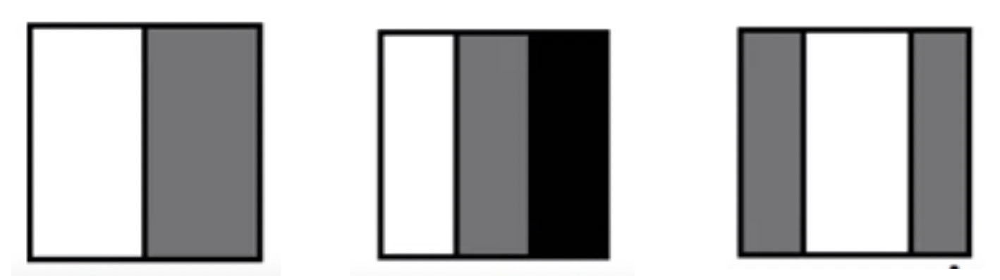
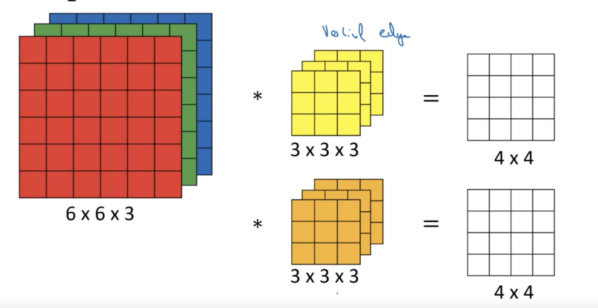
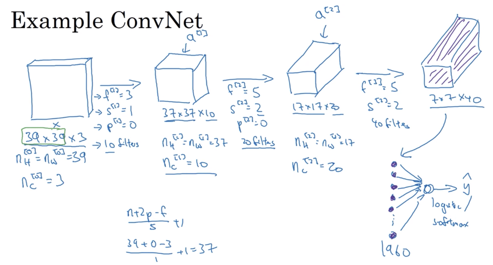

# 卷积神经网络（Convolutional Neural Network）
### 从DNN到CNN的原因
假设我们要对一个1000 * 1000 * 3的RGB图像做二分类，
那么输入$X$是一个3000000的向量，假设隐藏层有1000个节点，  
那么一共就约有3000000 * 1000 + 1000 * 1 个参数
参数太多，难以训练  

### 卷积运算的定义
* filter/kernel 过滤器/核
* stride 步长
* padding 补全
    * valid 不补全
    * same 补全为原来的大小  
        n - f + 1 + 2p = n  
        p = (f - 1) / 2  
        所以一般filter的大小为奇数 

输出大小的公式 (n - f + 2p) / s

### 边缘检测——卷积运算的几何直观
    

### 对RGB图像卷积  

* filter的层数永远与输入图像保持一致
* filter的个数决定了输出图像的层数

### 池化 pooling
* max/min-pooling  
    缩小图片，抽象特征，  
    获取局部特殊信息  
    比如边缘检测
* average-pooling  
    做图像平滑，消去噪点  
    获取局部整体信息  
要注意，最大池化层是没有参数的  

### CNN网络实例  
  
CNN中常见的三种层  
* 卷积
* 池化
* 全连接层 (Fully Connected)

### 利用CNN解决问题的流程
* 洗数据  
    * 把图片转换为numpy array
* 定义网络
     * 使用keras
* 训练
* 测试